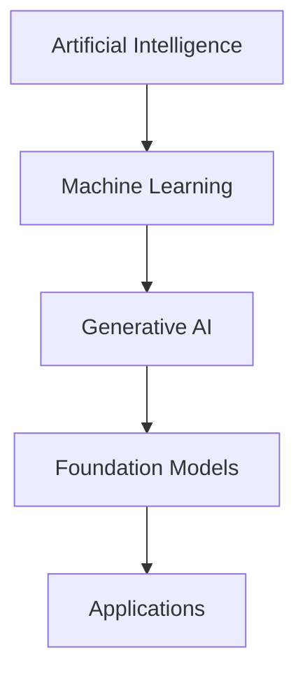
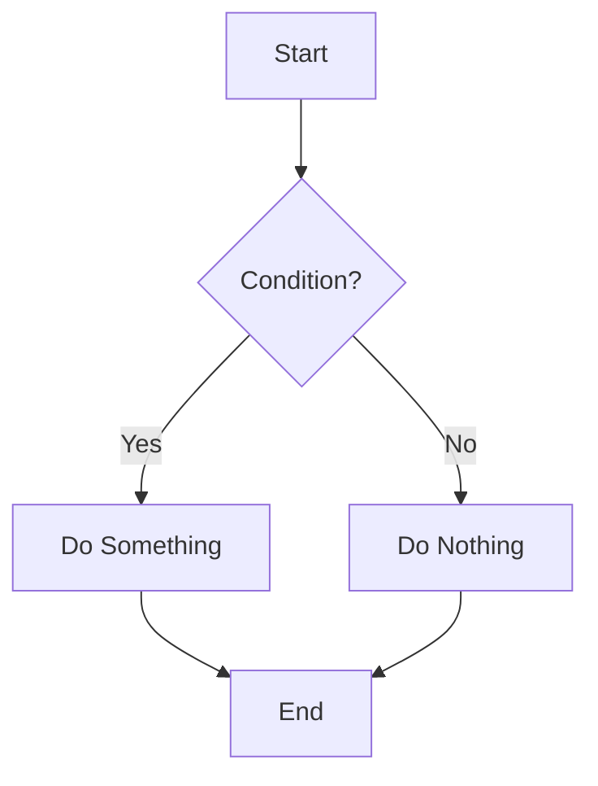
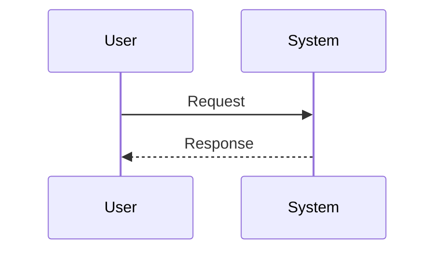
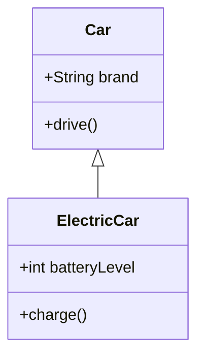
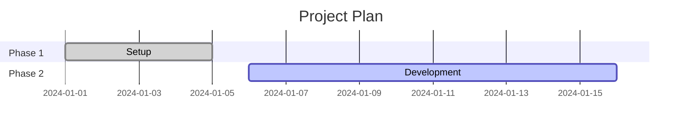

#  Tutorial: Mermaid CLI on Bluefin OS

Mermaid CLI (`mmdc`) lets you convert plain-text diagrams (Mermaid syntax) into **PNG / SVG / PDF**. On **Bluefin OS** (Fedora Silverblue/Kinoite family), `dnf` is restricted, so you need a **user-space only setup**. This guide shows you how to:

1. Set up Mermaid CLI on Bluefin.
2. Run a proof-of-concept diagram.
3. Learn the basics of the Mermaid language to start drawing your own diagrams.

---

## 1️⃣ Setup & Proof of Concept (POC)

### Step 1: Install Mermaid CLI with Homebrew

```bash
brew install mermaid-cli
```

### Step 2: Install Chromium with Puppeteer

Mermaid CLI depends on Puppeteer, which needs Chromium. Install it into your home directory:

```bash
npx puppeteer browsers install chrome
```

This will download Chromium into:

```bash
~/.cache/puppeteer/
```

### Step 3: Point Mermaid CLI to Chromium

Export the path to Chromium so `mmdc` can find it:

```bash
export PUPPETEER_EXECUTABLE_PATH="$(find ~/.cache/puppeteer -type f -name chrome -o -name chrome-headless-shell | head -n 1)"
```

Check:

```bash
echo $PUPPETEER_EXECUTABLE_PATH
```

### Step 4: Create a Test Diagram

Make a file `test.mmd`:



### Step 5: Render It

```bash
mmdc -i test.mmd -o test.png
```

🎉 Now you'll see `test.png` — your first Mermaid diagram!

---

## 2️⃣ Mermaid Language Quickstart

Mermaid uses a domain-specific language (DSL) for diagrams. You don't need to learn JavaScript — just simple text syntax.

Here are some examples you can copy into `.mmd` files:

### 🔹 Example 1: Flowchart



### 🔹 Example 2: Sequence Diagram



### 🔹 Example 3: Class Diagram



### 🔹 Example 4: Gantt Chart



---

## 3️⃣ Make Setup Permanent

Add the Chromium export line to your shell config (`~/.bashrc` or `~/.zshrc`):

```bash
echo 'export PUPPETEER_EXECUTABLE_PATH="$(find ~/.cache/puppeteer -type f -name chrome -o -name chrome-headless-shell | head -n 1)"' >> ~/.bashrc
```

Reload:

```bash
source ~/.bashrc
```

Optional: Add an alias to simplify usage:

```bash
echo 'alias mermaid="mmdc -i"' >> ~/.bashrc
```

Now you can run:

```bash
mermaid test.mmd -o test.png
```

### 🧹 Cleanup

To remove everything:

```bash
brew uninstall mermaid-cli
rm -rf ~/.cache/puppeteer
```

### 💡 Why This Approach?

- Runs fully in user space → no system pollution.
- Perfect for immutable Fedora systems like Bluefin OS.
- Easy to remove or reinstall.

---

## 🚀 Quick Reference Commands

| Command | Purpose |
|---------|---------|
| `mmdc -i input.mmd -o output.png` | Convert Mermaid to PNG |
| `mmdc -i input.mmd -o output.svg` | Convert Mermaid to SVG |
| `mmdc -i input.mmd -o output.pdf` | Convert Mermaid to PDF |
| `mmdc --help` | Show all options |

## 📚 Common Mermaid Diagram Types

- **Flowcharts**: `flowchart TD` or `flowchart LR`
- **Sequence Diagrams**: `sequenceDiagram`
- **Class Diagrams**: `classDiagram`
- **State Diagrams**: `stateDiagram-v2`
- **Gantt Charts**: `gantt`
- **Pie Charts**: `pie`

## 🔧 Troubleshooting

**Issue**: `Error: Failed to launch the browser process!`
**Solution**: Make sure `PUPPETEER_EXECUTABLE_PATH` is set correctly and Chromium is installed.

**Issue**: `Command not found: mmdc`
**Solution**: Check that Homebrew installed mermaid-cli correctly: `brew list mermaid-cli`

**Issue**: Diagram looks wrong
**Solution**: Check your Mermaid syntax at [mermaid.live](https://mermaid.live) first.

---

Now you're ready to create beautiful diagrams from simple text files on your Bluefin system! 🎨
